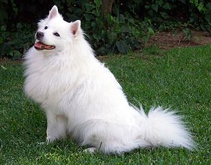
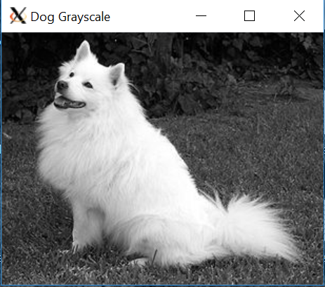

Welcome back! I hope you all set up your OpenCV environment!

To start, test that your install succeeded:
```python
import cv2
print(cv2.__version__)
```

If you get any import errors, review the installation steps provided in the previous guide. In the last guide, I only mentioned installing OpenCV; in my opinion, most confusion stems from installing the package. However, you are also going to need numpy and matplotlib, both of which I recommend installing through pip. Test the installs as follows: 
```python
import numpy as np
import matplotlib

print(np.__version__)
print(matplotlib.__version__)
```

With the software packages out of the way, let's read in an image. How about this picture of a dog? 


To do this, we use ```python cv2.imread(_path_, _mode_)```, which reads the image at _path_ encoded in _mode_. _mode_ can be a variety of constants, including ```python cv2.IMREAD_COLOR```, which is the default argument for _mode_ and it loads the image in color. ```python cv2.IMREAD_GRAYSCALE``` represents the image in grayscale, where each pixel represents an intensity value between 0 and 255. Finally, ```python cv2.IMREAD_UNCHANGED```  not only loads the image in color, but also includes an alpha transparency value for each pixel. For now, let's just stick with grayscale images. To load an image called dog.jpg in grayscale from our current directory into a variable called image, issue ```python image = cv2.imread('dog.jpg', cv2.IMREAD_GRAYSCALE)```.

We have a nice grayscale image, but how should we display it? ```python cv2.imshow(window_name, image_to_output)```  will create a window called window_name which displays image_to_output. The size of the output window will change with different images passed to the second argument. So, we will call ```python cv2.imshow('Dog Grayscale', image)```.

To allow us to close the window, we will use ```python cv2.waitKey(0)```. The "0" value passed to the function will force it to wait for a keypress. In the case that a keypress event is detected, program execution can continue, causing ```python cv2.destroyAllWindows()``` to destroy our image window(s). Note that multiple windows can be created by a single program, but they must have different names. The waitKey() function is necessary for images to display: it internally handles other events besides just keypresses. 

Here is the finished image display program:
```python 
import cv2

image = cv2.imread('dog.jpg', cv2.IMREAD_GRAYSCALE)
cv2.imshow('Dog Grayscale', image)
cv2.waitKey(0)
cv2.destroyAllWindows()
```

Here is a screenshot of the grayscale image displaying through Xming (the application is running remotely on my Pi 4):


Note that there are some quirks associated with reading in an image of color. OpenCV represents color images in the BGR (blue, green, and red) format. This is not compliant with many other packages, which require RGB images. This is when you'll want to use 
```python out = cv2.cvtColor(in, cv2.BGR2RGB)```, where in is the input (BGR) image, and out is the resulting (RGB) image. 
