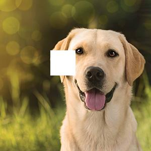

Sorry for the delayed release schedule, everyone. I unfortunately destroyed the package manager on my Raspberry Pi, and experienced some technical delays as a result.

Let's talk a litte bit about how OpenCV internally represents images after they've been loaded into memory by cv2.imread(). Modern versions of OpenCV rely on a Python library known as Numpy. Numpy enables fast numerical computation with matrices. As part of OpenCV's compliance with Numpy, pixels or portions of loaded images can be accessed like Numpy matrices.

First, let's reference a single pixel. Suppose we've loaded in an image, img:

```python
pixel = img[100,100]
print(pixel)
``` 
Remember that the output should be interpreted as the BGR value at that pixel location. This is interesting, but we can also change the color components' values at a specific pixel:

```python
img[100,100] = [255, 255, 255]
``` 

[255, 255, 255] represents the color white. However, you will probably never see people modifying individual pixel values like this. The real power of OpenCV/Numpy is performing operations with matrices. This can be demonstrated by modifying an ROI, or Region of Interest.

```python
img[100:150,100:150] = [255, 255, 255]
``` 

With my (different) image of a dog, I see the following:



Some characteristics of an image are important, like its shape (matrix dimensions) or datatype.

```python
print(img.shape)
print(img.dtype)
``` 

The operations we learned today are very intuitive, and we'll move onto more advanced operations shortly. We are getting to the backbone of computer vision!

For the remainder of these articles, I will not describe trivial operations, such as showing an image or loading it into memory. However, the source code for each article will be available in the 'Code' folder, for reference. 
